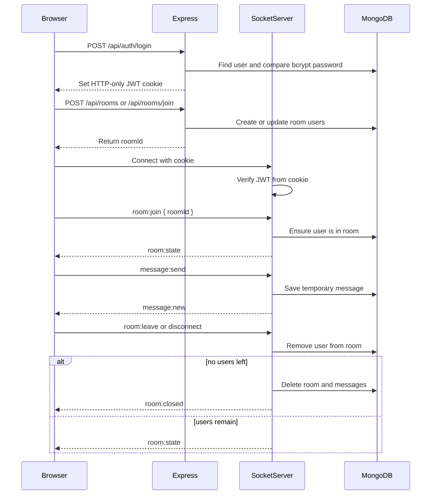

# MERN Temporary Room Chat Guide

This project is split into a TypeScript Express API and a TypeScript React client.

## Folder Structure

```text
Chat-App/
  client/
    src/
      components/       Shared UI pieces and route guards
      context/          AuthContext and ThemeContext
      pages/            Login, Signup, Dashboard, Chat Room
      services/         Axios API clients
      socket/           Socket.IO client setup
      types/            Shared frontend TypeScript interfaces
      utils/            File and sound helpers
  server/
    src/
      config/           Environment and MongoDB connection
      controllers/      Express request handlers
      middleware/       Auth, validation, error handling
      models/           Mongoose schemas
      routes/           API route definitions
      services/         Business logic for auth, rooms, messages
      socket/           Socket.IO server events
      types/            Express request and auth types
      utils/            JWT, cookies, async handlers, app errors
      validations/      Zod schemas
```

## Main Concepts

Authentication uses JWTs stored in HTTP-only cookies. The frontend never stores the token in localStorage, which helps protect sessions from XSS token theft.

Protected HTTP routes use `protect` middleware. It reads the cookie, verifies the JWT, loads the user, and attaches a safe user object to `req.user`.

Rooms are temporary. A room has a six-character `roomId`, a creator, current users, and an `isActive` flag. Messages are stored only while the room exists.

Messages are deleted permanently when the creator closes the room or when the last user leaves or disconnects.

Socket.IO uses the same HTTP-only cookie. During the socket handshake, the server reads the cookie from headers and authenticates the socket before allowing room events.

## API Summary

Auth:

```text
POST /api/auth/register
POST /api/auth/login
POST /api/auth/logout
GET  /api/auth/me
```

Rooms:

```text
POST /api/rooms
POST /api/rooms/join
GET  /api/rooms/:roomId
GET  /api/rooms/:roomId/messages
POST /api/rooms/:roomId/leave
POST /api/rooms/:roomId/close
```

## Socket.IO Flow



## Step-by-Step Implementation

1. `User` model stores `name`, `email`, and hashed `password`.
2. `bcrypt` hashes the password in the Mongoose `pre("save")` hook.
3. Auth controllers register, login, logout, and return the current user.
4. JWTs are signed on login/register and saved in HTTP-only cookies.
5. `protect` middleware guards room and message routes.
6. Zod validates auth payloads, room IDs, text messages, file messages, and reactions.
7. `Room` model tracks creator and active users.
8. `Message` model stores temporary text/file messages and reactions.
9. Room service deletes messages with `Message.deleteMany({ roomId })` when a room closes or empties.
10. Socket.IO joins authenticated users to realtime rooms and emits messages, notices, typing status, reactions, and room state.
11. React AuthContext keeps the logged-in user globally available.
12. Protected routes redirect unauthenticated users to `/login`.
13. Dashboard creates rooms and joins rooms by ID.
14. Chat room page handles live messages, online users, typing, file sharing, reactions, sound, copy room ID, and dark mode.

## Cleanup Rules

Creator closes room:

```text
closeRoom -> delete room -> delete all messages -> emit room:closed
```

All users leave or disconnect:

```text
leaveRoom -> users becomes empty -> delete room -> delete all messages
```

## Security Best Practices

Use a long random `JWT_SECRET` in production.

Keep JWTs in HTTP-only cookies, not browser storage.

Use `secure: true` cookies in production with HTTPS.

Use `sameSite: "none"` only with HTTPS for cross-site deployments. Local development uses `lax`.

Validate every request body and route parameter with Zod.

Never return password hashes from the API.

Limit JSON body size and temporary file size.

Check room membership before reading, sending, reacting, or sharing files.

Only the creator can close a room.

Delete temporary messages on room close or empty-room cleanup.

Use CORS with a specific `CLIENT_URL` and `credentials: true`, not a wildcard origin.

## Bonus Features Included

Typing indicator, emoji picker, dark mode, copy room ID, sound notification, temporary file sharing, and message reactions are implemented.
